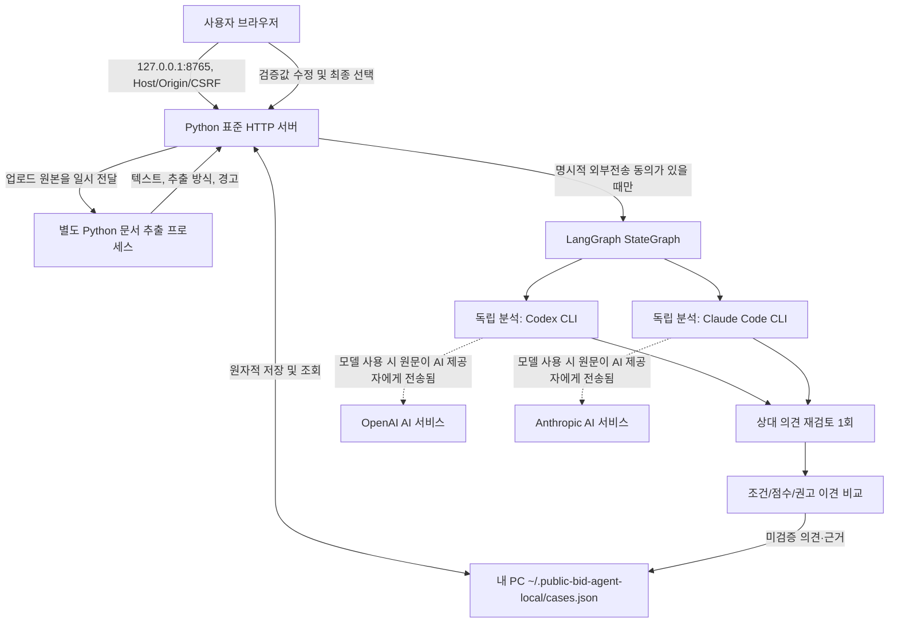

# Public Bid Agent | 공공 입찰 참여 의사결정 지원

> 구현 단계: **사용자 PC에서 실행하는 로컬 Python MVP** + 별도로 보존 중인 React/FastAPI 화면 시안. 실제 AI 계정 로그인·외부 문서의 의미 검증·보안 독립 검수·운영 배포는 완료되지 않았습니다.
>
> Python 기준: **CPython 3.12.x** (CI: Python 3.12). 자세한 의존성·고지 의무는 [라이선스 검토](docs/DEPENDENCIES_AND_LICENSES.md)에 기록합니다.

## 1. 이 프로젝트가 해결하는 문제

공고/RFP/회사 정보에서 *참여 자격, 기술 요구, 투입 자원, 원가, 경쟁 및 계약 리스크*의 근거를 구조화한 후 Codex와 Claude의 의견을 비교하고, 최종 사용자가 참여·보류·미참여를 결정합니다. AI 의견과 실제 법적 적격 여부, 최종 사용자 결정, 수주 결과는 분리해 기록합니다. **입찰서 자동 제출이나 실제 낙찰확률 제공을 구현하지 않았습니다.**

## 2. 현재 로컬 실행 아키텍처



- 브라우저: `local_app/index.html`, `local_app/app.js`. 프롬프트 입력·파일 선택·동의·AI 의견 및 이견 표시·영향인자 검증·최종 선택.
- HTTP 및 로컬 저장: `local_app/server.py`. loopback 전용, `cases.json` 원자적 갱신, 8개 필수조건과 12개 비교인자, 사용자 최종결정 별도 저장.
- 문서 파서: `local_app/extractors.py`. PDF/한국어 OCR, Excel, HWP/HWPX, DOCX 및 일반 텍스트. 추출 제한/경고 표시. 별도 subprocess이지만 OS 수준의 완전한 악성파일 샌드박스는 아닙니다.
- AI 워크플로: `local_app/cross_review.py`. **실제 LangGraph** 노드 `independent_analysis → peer_critique → evidence_comparison`. 상대 모델을 1회씩 재검토하고 근거/값의 이견을 정리합니다. LangChain Core `ChatPromptTemplate`를 사용합니다. 한 모델만 성공하면 가짜 합의를 만들지 않습니다.
- 외부 실행: 설치·로그인된 `codex`/`claude` CLI만 명시적 동의 후 사용. 인스턴스/토큰을 직접 수집하지 않습니다. **실제 두 모델 인증·요금제 실행 성공은 사용자 PC에서 확인해야 합니다.** 한 공급자의 CLI 실패는 명시적 실패로 표시합니다.
- 저장: 앱 업무 데이터는 사용자 홈의 JSON에만 저장합니다. 모델 사용 시 자료가 선택한 업체로 전송되고, 각 CLI 자체의 세션·캐시 저장은 앱의 통제 밖입니다.

## 3. Python 설치 및 실행

### Windows PowerShell

Python 3.12.x를 설치하고 저장소 루트에서 실행합니다. `py -3.12 --version`으로 설치 버전을 확인합니다. **2026년의 Python 3.12 보안 릴리스는 소스 배포만 제공하므로 Windows 3.12 설치 프로그램 제공 여부를 공식 다운로드 페이지에서 확인**하고, 운영 PC의 보안 업데이트 정책을 따르세요.

```powershell
py -3.12 -m venv .venv
.\.venv\Scripts\python.exe -m pip install --upgrade pip
.\.venv\Scripts\python.exe -m pip install -r local_app/requirements.txt
.\.venv\Scripts\python.exe local_app/server.py
```

### macOS/Linux

```bash
python3.12 -m venv .venv
.venv/bin/python -m pip install --upgrade pip
.venv/bin/python -m pip install -r local_app/requirements.txt
.venv/bin/python local_app/server.py
```

실행 후 `http://127.0.0.1:8765/` 방문. 종료는 터미널 `Ctrl+C`. 파일은 **`~/.public-bid-agent-local/cases.json`** 에 로컬 저장됩니다. 필요 시 `PUBLIC_BID_LOCAL_DATA` 및 `PUBLIC_BID_LOCAL_PORT` 환경변수를 설정합니다. `.venv`와 JSON은 Git에 넣지 않습니다.

### 스캔 PDF OCR 준비

별도 실행 파일 **Tesseract OCR**과 `kor`, `eng` 언어팩이 필요합니다. `tesseract --list-langs`로 확인합니다.

- Windows: Tesseract 배포판 설치 시 `kor` 선택, PATH 설정.
- Ubuntu/Debian: `sudo apt-get install tesseract-ocr tesseract-ocr-kor tesseract-ocr-eng`.
- macOS: `brew install tesseract tesseract-lang`.

## 4. 사용 순서

1. **공고 만들기**로 가상·실제 공고에 대한 로컬 검토 건을 생성합니다.
2. 설명 프롬프트를 작성하거나 **Excel(XLSX/XLS/XLSM), 일반·스캔 PDF, HWP/HWPX, DOCX, TXT/MD/CSV/JSON**을 선택해 텍스트를 추출합니다. PDF·표·OCR의 추출 한도와 누락 경고를 읽습니다.
3. 자신의 컴퓨터에 설치된 Codex/Claude Code CLI를 공식 절차로 인증하고, AI 사용 제공자를 선택합니다. **AI에 보낼 자료를 확인하고 외부 전송에 동의한 뒤** 실행합니다.
4. 모델별 독립 의견, 상대 의견 검토 및 이견 목록을 확인합니다. **2개 모델 선택 시 최대 4회 모델 요청**이 발생할 수 있습니다. API 비용·구독 이용 자격은 CLI 제공자의 계약·사용 정책에 따릅니다.
5. `AI 초안 적용` 버튼으로 미검증 영향인자를 채운 뒤 원문을 확인하여 오입력을 수정하고, 확인 항목에만 체크합니다. 자동 점수는 **실제 수주확률이 아닙니다**.
6. 최종 **참여/보류/미참여**를 직접 선택하면 사람이 선택한 결정과 이유가 JSON에 저장됩니다. AI는 최종 결정을 수정하지 않습니다.

설치·사용 방법 상세는 [local_app/README.md](local_app/README.md)와 동일 기준으로 유지합니다.

## 5. 데이터 흐름 및 저장 경계

- 원본 업로드 파일 바이너리는 업무 JSON에 넣지 않고 추출 텍스트·출처 파일명·추출 방식·경고를 기록합니다.
- JSON은 암호화되지 않습니다. PC/계정 권한, 디스크 암호화, 백업 범위는 사용자가 관리해야 합니다.
- 문서 내부에 있는 악성 프롬프트는 **비신뢰 데이터**입니다. 공식 입찰요건·금액·계약조건 등 중요한 사실은 사람이 원문과 증빙을 직접 확인해야 합니다.
- 선택한 AI 분석 요청 때에는 해당 원문 텍스트가 외부 서비스로 이동합니다. 기업 내부 문서는 회사 허가·기밀 유지 및 AI 서비스 계약을 먼저 확인하세요.
- 파일당 10MiB, 공고당 6개. 추출 텍스트 파일당 최대 44,000자, 모델 입력 90,000자, PDF 최대 40페이지/OCR 12페이지 등 현재 제한이 있습니다.

## 6. 기존 웹 UI 시안과의 관계

별도 `frontend/`(React/Vite)과 `backend/`(FastAPI)는 합성 공고 검색/입찰관리 화면 설계 시안입니다. **현재 로컬 앱과 동일한 프로덕션 서비스가 아니며**, 실제 나라장터 API·Google 로그인·PostgreSQL/RAG·공개 운영 배포는 완료되지 않았습니다.

- [웹 입찰관리 UI 시안](frontend/public/bid-management-preview.html)
- [계정 선택 UI 시안](frontend/public/ai-account-preview.html): 진짜 OAuth 연결 아님
- [미래 확장 아키텍처](docs/02-architecture.md): 로컬 우선 결정에 맞춰 별도 목표 구조로 유지

## 7. 테스트 및 변경 시 문서 갱신

```bash
python -m unittest discover -s local_app -p 'test_*.py' -v
node --check local_app/app.js
python scripts/check_documentation_sync.py
```

**코드·의존성·UI/API 계약이 변경되는 커밋에는 `README.md`와 `local_app/README.md`를 같은 커밋에서 갱신**해야 하며, GitHub CI가 이를 검사합니다. 아키텍처·데이터 흐름·새 모델/패키지·사용법이 바뀌면 `docs/02-architecture.md` 및 [의존성 라이선스 검토](docs/DEPENDENCIES_AND_LICENSES.md), `AGENTS.md`, `CURRENT_STATE.md`와 `TASKS.md`의 관련 부분도 같이 수정합니다. 이 검사는 문서 **수정 여부**를 강제하는 것이며 사실 관계까지 자동 보증하지 않으므로 PR 리뷰에서 일치 여부를 확인합니다.

## 8. 라이선스 및 미완료 게이트

코드·문서: [Apache License 2.0](LICENSE). 주요 패키지의 허용적 라이선스 사용은 가능하지만, **의존 패키지 전체와 PDFium/OCR 바이너리를 재배포할 때 고지·라이선스 파일 동봉 의무**가 존재합니다. [라이선스 검토표](docs/DEPENDENCIES_AND_LICENSES.md)와 [NOTICE](NOTICE) 참고. 인증·상용 모델 호출 계약은 오픈소스 코드 라이선스와 구분됩니다.

- CI: 실행형 로컬 코드와 문서 형식 테스트. **모의 AI CLI 응답으로 LangGraph 테스트**하며 실제 개인 계정으로 모델을 호출하지 않습니다.
- 미완료: 기관별 실제 HWP/RFP OCR 정확도, 완전한 파일 파서 샌드박스, LangGraph 영속 체크포인트/재개, 정식 RAG, 실제 두 모델 CLI 인증/출력 E2E, 독립 최종 보안 검수와 사용자 UI 승인.
- 검수 전 개발 브랜치 `feat/sprint1-search-demo` 및 [Draft PR #1](https://github.com/son1004007/public-bid-agent/pull/1) 유지. 사용자 승인 없는 운영 배포/`main` 병합은 진행하지 않습니다.
> CI 의존성 계약: 각 Python 패키지는 `local_app/requirements.txt`에 한 줄씩 기록합니다. 2026-10-09 LangGraph 추가 시 줄바꿈 오류를 검사하고 수정했습니다.

## 2026-10-10 Codex 단독 실행 모드

Claude Code 구독이 없더라도 Codex CLI 로그인만으로 독립 영향인자 분석 1회 → 미검증 초안 → 사용자 수정/원문 대조 → 최종 Bid/No-Bid를 수행합니다. 단일 AI는 교차검토가 아니므로 합의한 것처럼 표시하지 않습니다. Windows npm 설치는 확장자 없는 `codex`가 아닌 `codex.cmd`를 실행합니다. 계정 기본 모델이 Codex에서 지원되지 않을 수 있으므로 이 로컬 앱은 `gpt-5.6-terra`를 명시하고, `--ephemeral --ignore-user-config --ignore-rules --sandbox read-only`로 실행합니다. 모델 접근 권한은 계정/버전마다 다르므로 실패 시 UI에서 오류를 확인합니다.


### Windows 실환경 Codex 단독 테스트 (2026-10-10)

회사 노트북의 **합성 공고만** 사용한 기능 확인: Windows + Python 3.12 + Codex CLI 0.154.0, ChatGPT 인증. `-m gpt-5.6-terra`와 `--ephemeral --ignore-user-config --ignore-rules --sandbox read-only`로 한 차례 모델 요청, `/api/analyze` 성공. JSON에 필수 Gate **8개**, 비교 인자 **12개**, 권고 `hold`, `ai_draft`, `cross_review.status=single_or_failed` 기록 확인. 사람의 `decision=undecided` 유지 확인, 모델 응답 **21.2초**. 실제 Claude 연동/교차반론은 수행하지 않음.

해당 Windows 사용자에게 로컬 전용 시작 바로가기 `Public Bid Agent (Local)`를 만들었으며 `http://127.0.0.1:8765/` 접근 성공. 바탕화면 바로가기는 배포 소스가 아니라 **해당 노트북의 편의 실행 설정**입니다. 앱 업무 JSON과 테스트 JSON의 위치를 분리했고 바인딩은 `127.0.0.1`로 한정합니다. 개인 Codex 설정은 변경하지 않았습니다.

## 공개된 실제 입찰공고 3건을 이용한 MVP 검증 (2026-10-10)

`local_app/fixtures/public_tenders_2026_10_10.json`에는 공개 입찰공고 **3건의 수기 전사 정보**와 **실제 회사가 아닌 가상 부서 4개 시나리오**를 저장합니다. [공고/업체 개인정보 및 재현성 검증](local_app/test_public_tenders.py)은 소스 URL과 공고번호/마감/가정 자료의 구분을 확인합니다. 공식 나라장터 원본 첨부 다운로드는 403 오류여서 직접 검증하지 못했으므로, 전재문·메타데이터 출처를 명시하고 실제 입찰 전 정정/마감 확인이 필수입니다. **실제 어니컴 부서의 인력·등록 자격·실적은 입력하거나 추정하지 않았습니다.** 이 자료는 실제 낙찰 확률의 정답 데이터가 아닙니다.

### 2026-10-10 실제 공고 검증 결과에서 나온 변경

실제 공고 3개 / 가상 부서 4개로 Codex를 실행했을 때 모델은 모두 보류 권고를 냈고 `reason`을 비워 반환했습니다. 단순 보류만 표시하면 **명시적 참가요건 불일치와 자료 부족을 구별하지 못하므로**, `local_app/decision_support.py`를 추가했습니다. `REVIEW_NO_BID_PROVISIONAL`(AI 제시 미충족), `HOLD_UNVERIFIED`, `HOLD_CONFLICT`, `READY_FOR_HUMAN` 등은 AI의 판단/사용자 결정과 별도로 저장됩니다. AI가 작성하지 않은 권고 사유는 임의로 생성하지 않고 **모델 사유 미제공** 경고로 보여줍니다. 공고 사실은 재게시 공개자료, 업체·부서 조건은 가정값임을 표시합니다.

## 2026-10-10 실공고 수기 MVP 검증 상태

**공개 입찰공고 3건 + 가상 부서 조건 4개**를 실제 Codex 구독으로 분석하고, AI 원문/하드게이트/원문 미확인/사람 결정을 로컬 JSON에 구분해 저장했습니다. 실제 AI 4건 분석과 개정 HTTP 위험 재분류에 성공했습니다. 자세한 수치와 원문 출처 제한은 [MVP 검증 보고서](docs/reviews/MVP_PUBLIC_BID_E2E_2026-10-10.md)를 참고하세요. 회사 노트북 `Public Bid Agent (Local)` 바로가기로 확인할 수 있으며 검증 사례의 회사 능력은 전부 **가상**입니다. **AGY/Codex 독립 최종 검수는 원격 권한 정책으로 막혀 `main` 병합을 보류**합니다. 권한을 우회하지 않습니다.

## 2026-10-10 독립변수 20개 확인 방법

로컬 앱에서 공고를 선택하면 **'AI 독립변수 20개 및 추출 근거 (읽기 전용, 미검증)'** 영역이 표시됩니다. Codex가 수집한 Gate 8개와 비교인자 12개의 **원본 status/score/evidence**를 수기 '초안 적용' 없이 즉시 볼 수 있습니다. 여기는 읽기 전용이며 실제 사용자 보정·확인/저장은 아래 수기 입력칸과 별도로 진행됩니다. 기존 AI 모델 출력/사람 결정은 보기 동작에서 바뀌지 않습니다. 점수는 모든 평가요인에서 '높을수록 유리'하도록 정의했고, risk=위험 통제(5점=통제 양호), bid_cost=제안비용 부담(5점=부담 낮음)을 프롬프트에 명시했습니다. 과거 AI 모델이 위험을 '위험이 클수록 5점'으로 매긴 샘플이 있어 이전 결과는 재검토 대상이며 자동 수정하지 않습니다.

## 팀장용 문서 준비 가이드와 20개 독립변수 연결 (2026-10-10)

앱 첫 화면(공고 등록 전에도 접근 가능)의 **'입찰 판단에 필요한 문서 5종과 변수별 증빙 안내'**를 열면 원본 보유 담당부서·문서 예시·추출 변수·미확인 시 질문·보안 주의사항이 표시됩니다. **1. 입찰공고문/정정공고, 2. 제안요청서·과업지시서(외부 발주기관 자료), 3. 업체등록·면허/인증, 4. 유사실적·기술·가용 인력현황, 5. 프로젝트별 원가·제안계획/위험관리(회사 내부자료)** 다섯 묶음이 추천 순서입니다. '5종'은 파일 개수 제한이 아니라 자료 범주입니다. 경쟁업체·과거 발주경향 등 일부 인자는 추가 공개자료가 없으면 미확인으로 유지합니다.

실행 화면과 CI 검사의 단일 원본은 [문서-독립변수 매핑 JSON](local_app/document_guide.json)이며, Hard Gate 8개와 12개 평가요인이 모두 어떤 자료에서 확인 가능한지 및 담당자 확인 질문을 포함합니다. 5종 전체가 법적 입찰자격 충족을 보장하지 않으며 AI 추출 근거를 사람이 원문·증빙과 대조해야 합니다. **회사 기밀 원본·인력 개인정보·원가 세부표·인증서 비밀키를 허가 없이 외부 Codex/Claude에 전송하지 않습니다.** 허가가 없으면 공개 공고문과 승인된 비식별·가상 업무 요약만 AI에 전달하고 내부조건은 수기 평가로 보완합니다. 로컬 JSON도 평문이므로 회사 승인과 PC 접근통제가 필요합니다. 앱은 문서 종류를 자동 판별해 인증하는 기능을 구현하지 않았으며, 안내·수기 업로드용입니다.

## 2026-10-10 회사 운영정보와 공고별 원가 산정 (로컬 MVP)

'회사 운영정보'는 팀장·PMO/인사/재무/영업 자료가 섞인 **기준 데이터**이므로 5번 문서 하나를 반복 업로드하는 방식으로 구현하지 않았습니다. **`operations.json`(직무별 월 총원가/가용 MM, 간접비율·위험충당률) → 공고별 `cases.json.cost_plan`(투입 MM·외주비·직접경비·제안비용·예정 공급가액) → `cost_estimate`(VAT 제외 예상 원가/사업이익/이익률·주의사항)** 구조를 제공합니다. **회사 운영정보는 LLM에 자동 전달하지 않으며**, 모델 분석과 인간의 입찰 최종결정을 보존합니다. 개인정보/개인급여/고객정보를 입력하지 않으며, 실제 운영·원가 데이터는 회사 정책 승인 전 입력·전송하지 않습니다.

업데이트 시 역할 기준의 revision이 증가하며 각 공고별 이전 견적은 구 버전 표시/재계산 필요로 처리합니다. 공수 초과와 단가 0, 공수 0 및 공급가액 미입력은 경고합니다. 공급가액은 **부가가치세 제외** 원화 정수이고, 월 총원가는 사업 인건비의 고용주 부담 총원가 기준입니다. 예정이익은 **예정 공급가액 − (직접인건비+외주비+직접경비+간접비+위험충당+제안준비비)** 로 산출합니다. 현금흐름·법정 사업대가·실제 수주확률은 계산하지 않습니다. 가용 MM은 이 화면 내 각 공고별 참조용으로, 여러 공고 또는 기존 수행 사업의 중복배정 자동 집계가 아닙니다.

### 실제 운영자료 8종의 확보·검증 상태 관리

원가 기준표 외에, 팀장·PMO·인사·재무·영업 등이 관리하는 **사업자격/인증, 수행 중 프로젝트/가용인력, 과거 수행실적/손익, 협력사·단가, 재무·수금, 제안 파이프라인, 사업전략, 계약·품질 위험**의 8개 장부를 별도의 **자료 수집·검토 상태**로 관리합니다. 화면에서 항목별 담당 부서, 상태(`미수집`/`갱신 필요`/`요약·출처 확인`), 승인된 최소 요약, 문서명과 확인일을 수기 기록합니다. 요약·출처·날짜 없이는 '검토 완료'가 저장되지 않습니다. 이는 업로드 원문을 법적 증빙으로 인증하는 기능이 아니며, 예상 원가 계산이나 Codex에 **자동 포함하지 않습니다**. 실제 인사·재무·고객 자료는 회사 승인 전 등록 금지. 다른 부서 데이터의 API 연동·정합성 검증은 추후 단계로 남깁니다.

### 운영자료 확인일 형식 검사

운영 장부 8종의 확인일은 `YYYY-MM-DD` ISO 날짜이고 **달력에 실재하는 날짜**여야 합니다. `2026-02-30` 등 잘못된 날짜는 저장 거부합니다. 원본 문서의 실제 발행일·검증 여부까지 법적으로 증명하는 기능은 아니며 담당자의 출처 대조가 필요합니다. 수정 커밋에서 루트/로컬 README를 함께 갱신하고 push 및 PR CI를 다시 확인합니다.

## 회사 운영정보 실제 검증 증거 (2026-10-10)

Windows 회사 노트북의 **가상 원가 데이터**로 회사 기준정보 저장→공고별 원가계산→JSON 분리→운영기준 변경에 따른 구버전 경고를 검증했습니다. 50개 Python 테스트·GitHub push/PR CI 통과. 원가 예시 **공급가액 50,000,000원 / 총원가 37,805,000원 / 이익 12,195,000원(24.4%)**. 담당 부서별 운영자료 8종의 검토상태도 가상 요약으로 확인했습니다. 기존 사용자 입찰 4건은 보존. [상세 검증 보고서](docs/reviews/OPERATIONS_COST_E2E_2026-10-10.md). 독립 코드 리뷰 및 사용자 화면 클릭 검증은 미완료이므로 main 병합은 HOLD입니다.

## 2026-10-10 공고 중심 참여판단 UI 재설계 — 퍼블리싱 우선

**[새 공고 수집·참여판단 대시보드 화면](frontend/public/bid-decision-dashboard-preview.html)** 을 퍼블리싱했습니다. 회사 노트북의 기존 로컬 앱 `http://127.0.0.1:8765/`에서도 **새 입찰 의사결정 화면 열기**를 선택하면 `/decision-preview`로 열립니다. 이 시안은 React/백엔드 미연동 정적 HTML이며 합성 공고 8건으로만 탐색, 필터링, 공고별/일괄 판단 버튼, **참여 판단 기준 프로필**(기술 적합도·예상 이익률·필수 자격·운영 사업 처리), **영향인자 프로필**(8 Hard Gates·12 Factors 가중치 합 100%), **불참 이유/판단 근거/사용한 프로필 버전/사람의 최종결정/이력**을 시뮬레이션합니다. 공고 수집은 '평일 09시' 설정 구상과 가상 수집 버튼으로 표시하며, 실제 스케줄링·나라장터/API 호출·모델 요청·서버 JSON 프로필 영구 저장을 수행하지 않습니다. 프로필·판별 이력은 브라우저 메모리에서만 유지하며 새로고침 시 초기화됩니다. 사용자 화면 확인 전 실제 수집·자동 추천 정책/백엔드를 구현 완료라고 주장하지 않습니다.

### 화면 시안 판단기준/영향인자 동작 보완

정적 참여판단 시안의 12개 영향인자 가중치(합 100%)를 가상 영향인자 값과 결합해 **가중 종합 적합도(0~100)** 를 계산하고, 참여판단 프로필의 최소 적합도와 비교하도록 반영했습니다. 이는 **시안용 파생 점수로 실제 LLM 판별이나 예측 정확도를 입증하지 않습니다**. 과거 판단 결과는 프로필 변경만으로 자동 덮어쓰지 않고 버튼을 다시 누를 때 판단 기준 버전을 적용합니다. **담당자 최종 불참 기록**에는 별도 불참 사유 입력을 요구하며, 원래 가상 참고판단 사유와 구분하여 이력에 저장합니다(탭 메모리 한정).

### Chrome CSP 호환 퍼블리싱 시안 (2026-10-10)

Windows 실제 Chrome 헤드리스 검사에서 로컬 서버의 `Content-Security-Policy: script-src 'self'`가 시안 HTML의 inline script를 차단함을 확인했습니다. 보안 정책을 완화하지 않고 브라우저 코드를 `frontend/public/bid-decision-dashboard-preview.js`로 분리했으며 로컬 서버가 동일출처 `/bid-decision-dashboard-preview.js`로 제공합니다. 정적 HTML 단독 파일만 복사하면 동작하지 않으므로 같은 디렉터리의 JS도 함께 배포해야 합니다. 실제 브라우저 DOM에 공고 행과 프로필 요소가 표시되는지 검증한 뒤 UI 시연 완료를 판단합니다.

### 2026-10-10 Chrome 브라우저 퍼블리싱 확인

회사 노트북 `TD-kiseok`의 Chromium 기반 Chrome headless 실렌더링에서 새 대시보드 `http://127.0.0.1:8765/decision-preview`의 **합성 공고 8행, 현황 KPI 5개, 영향인자 가중치 입력 12개**가 DOM에 생성됨을 검증. 로컬 GET HTTP 200, CSP의 같은 출처 JS 로드, Node `--check` PASS. 검증 중 inline script CSP 차단을 실제 발견하여 정적 JS 파일로 분리하고 보안 헤더는 유지. GitHub push run [38049729286](https://github.com/son1004007/public-bid-agent/actions/runs/38049729286) SUCCESS / PR run [38049733578](https://github.com/son1004007/public-bid-agent/actions/runs/38049733578) SUCCESS. **클릭 상호작용의 브라우저 자동화 E2E 및 사용자의 UI 승인 = NOT RUN**. 현재 앱은 실제 나라장터 수집·AI 판별·프로필 영구 저장을 제공하지 않는 정적 설계 시안이며 main 병합은 HOLD.

### 2026-10-10 공고 전체 상세보기 퍼블리싱

새 공고 중심 대시보드 `/decision-preview`의 목록에 독립된 **상세보기** 버튼을 추가하여 전체 폭의 **공고 상세 화면**으로 이동합니다. 4개 탭: **기본정보(기관/예산/마감/원문·첨부 수집 여부), 참가자격·과업(요구범위 및 Hard Gate 8종), 영향인자·사업성(12개 Factor, 가중치, 기술·이익률 및 프로필 버전), 참여 판단·불참 사유(가상 참고권고와 사람의 최종결정, 명시적 불참 입력 및 이력)**. 목록 복귀/재판단을 제공합니다. `상세보기` 자체는 자동 AI 호출·평가·상태변경을 하지 않습니다. 사용자 입력 상태는 브라우저 탭 메모리만, 새로고침 시 초기화되며 실제 나라장터 원문/첨부·프로필 영구저장·AI 판별·사내 민감정보 전송은 미구현입니다. 정적 HTML과 동명 JS를 함께 제공하며 로컬 CSP를 유지합니다.

### 2026-10-10 상세 시안 검증 계약

최종 불참사유 필드는 상세 판단 탭을 열 때 JavaScript가 동적으로 생성되며, 정적 테스트는 해당 생성 계약을 확인합니다. 클릭 기반 Chrome 시연은 별도 검증 후 기록합니다.

## 상세보기 UI 검증 (2026-10-10)

공고 목록→전체 상세(4탭)→참여 판단 시연→사유를 입력한 담당자 불참 결정→상세/이력 재조회 **Chrome 클릭 19개 항목 PASS**. 상세보기 클릭만으로 판단이 실행되지는 않습니다. [상세 화면 검증 보고서](docs/ui/DECISION_DETAIL_PREVIEW_E2E_2026-10-10.md). 현재 합성 시연만 제공하며 실제 API/모델·영구저장은 미구현입니다.
